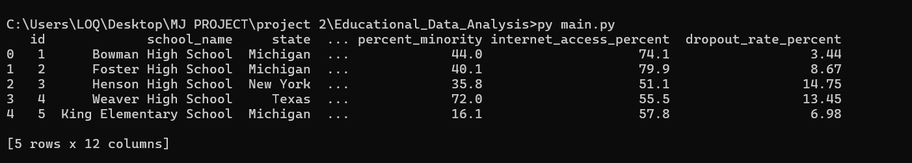
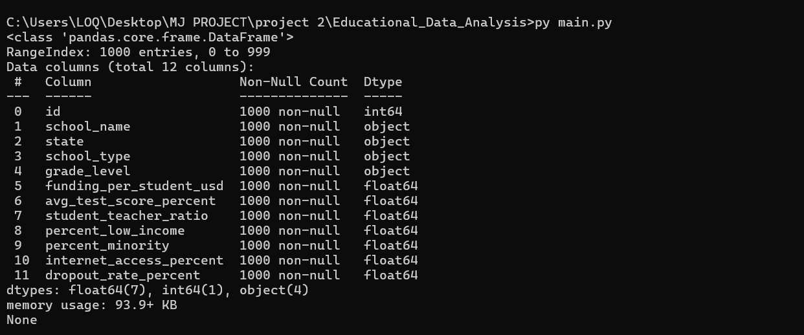
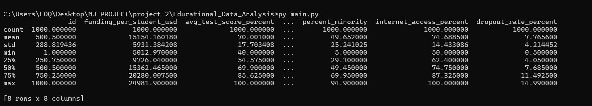
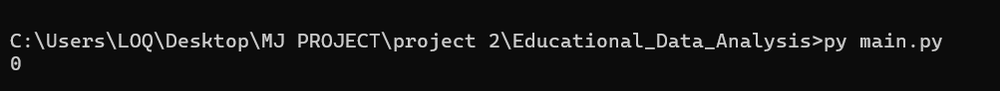

## Data Source

The dataset used in this project is from [Kaggle: Education Inequality Data](https://www.kaggle.com/datasets/shamimhasan8/education-inequality-data)  
License: [MIT License](https://opensource.org/licenses/MIT)  
Original author: Shamim Hasan

---
## A. Data Quality Check
### Preview (Screenshot)

- 🔼 *It gives us a look into our 1st 5 row*
- `df.head()`

- 🔼 *shows all column, data types, missing values....*
- `df.info()`

- 🔼 *It gives min,max,mean....*
- `df.describe()`

- 🔼 *Checks if we have any missing values*
- `df.isnull().sum()`

- 🔼 *Checks if we have any duplicates*
- `df.duplicated().sum()`
---