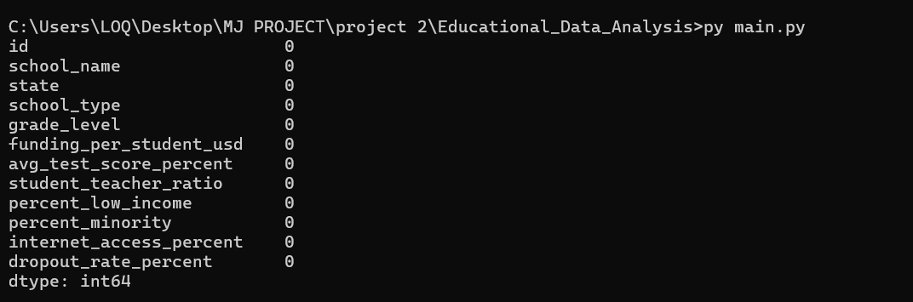
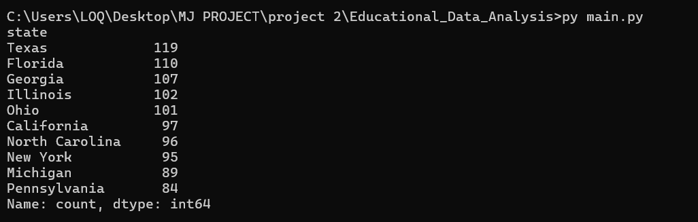
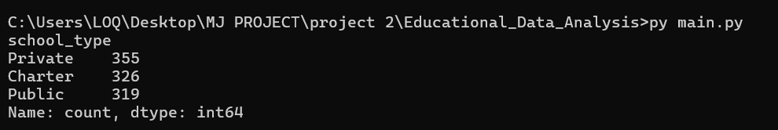
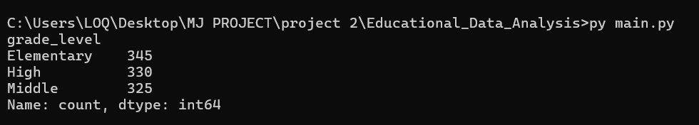
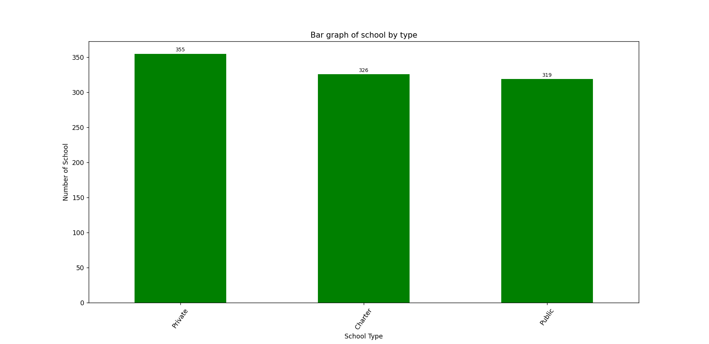
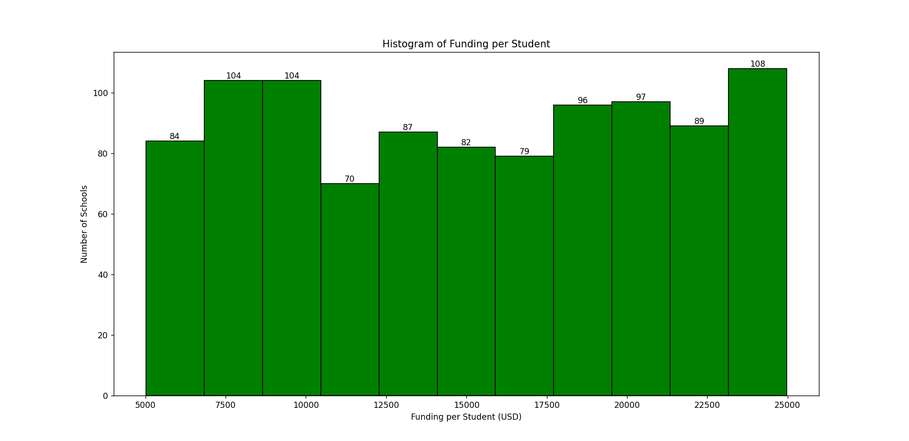
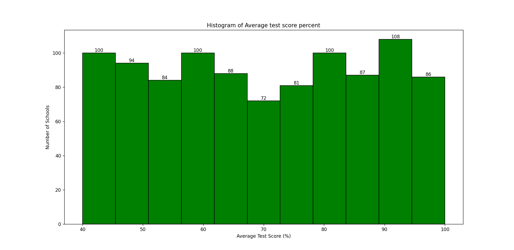
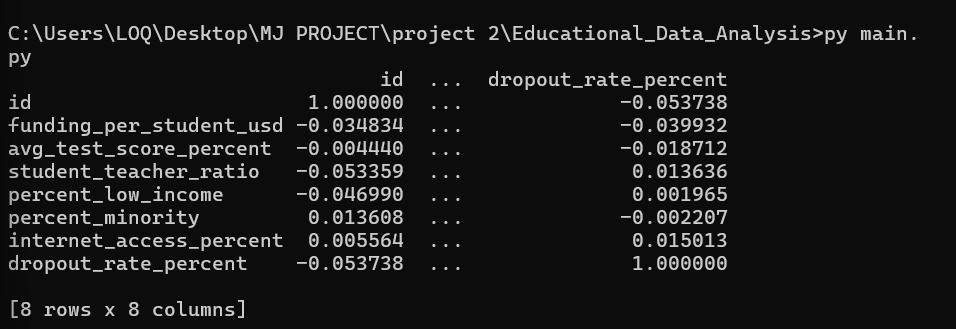
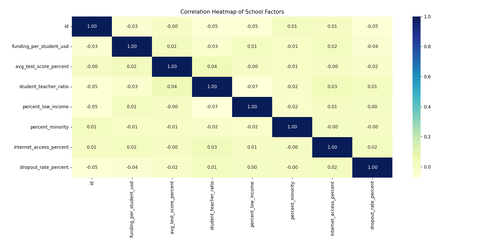

## Data Source

The dataset used in this project is from [Kaggle: Education Inequality Data](https://www.kaggle.com/datasets/shamimhasan8/education-inequality-data)  
License: [MIT License](https://opensource.org/licenses/MIT)  
Original author: Shamim Hasan

---
## A. Data Quality Check
### Preview (Screenshot)

- 🔼 *It gives us a look into our 1st 5 row*
- `df.head()`

- 🔼 *shows all column, data types, missing values....*
- `df.info()`

- 🔼 *It gives min,max,mean....*
- `df.describe()`

- 🔼 *Checks if we have any missing values*
- `df.isnull().sum()`

- 🔼 *Checks if we have any duplicates*
- `df.duplicated().sum()`
---

## B. Basic Summaries
### Preview (Screenshot)

- 🔼 *It gives us info on how many schools are there in states*
- `school_by_state`

- 🔼 *It gives us info on school type*
- `school_by_type`

- 🔼 *It gives us info on level of school*
- `school_by_level`
---

## C. Basic Visual
### Preview (Screenshot)

- 🔼 *Bar Graph on schools by type*
- `school_by_type`

- 🔼 *Histogram of funding per student (in usd)*
- `funding_per_student_usd`

- 🔼 *Histogram of average test score percent*
- `avg_test_score_percent`
---

## D. Find patterns & correlations
### Preview (Screenshot)

- 🔼 *Correlation summary in table format*
- `corr`

- 🔼 *Correlation Heatmap of School Factors*
- `heatmap`
---